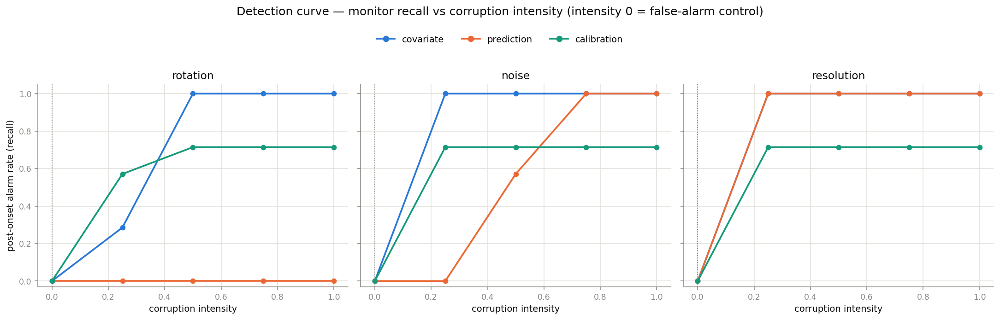
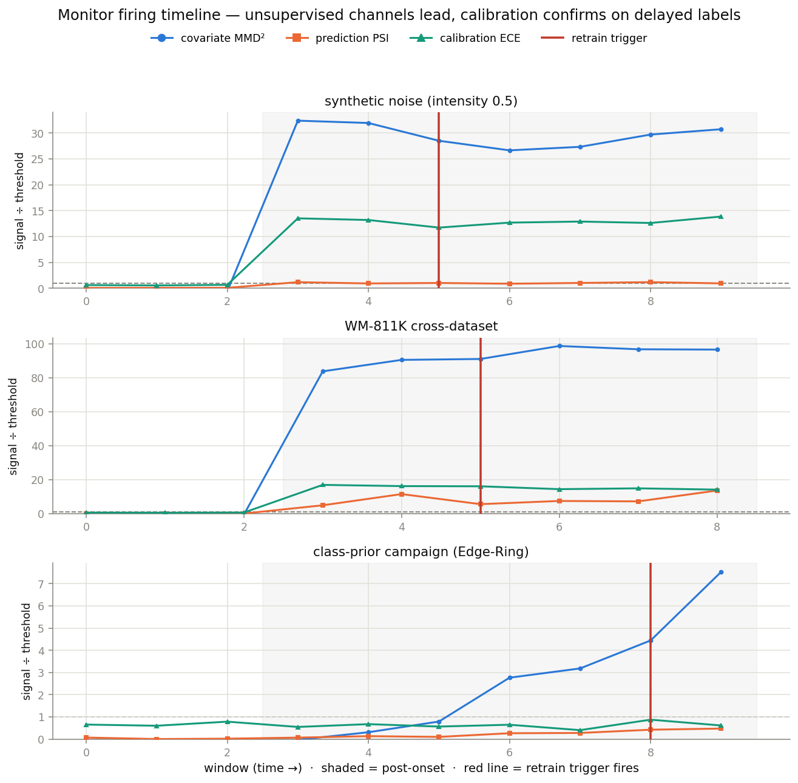
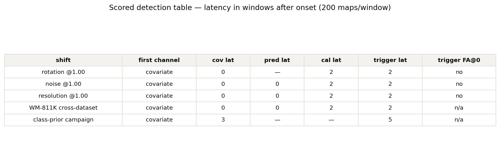
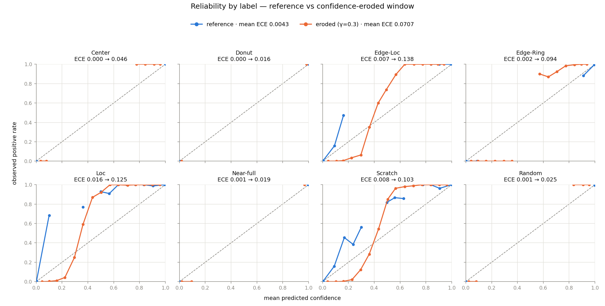

# wafer-deploy — model serving + drift monitoring

**Serve a calibrated wafer-defect model and know when to stop trusting it.** A
FastAPI inference service around the frozen [`wafer-mixed`](../wafer-mixed) model
(macro-F1 0.9846), wrapped in an **unsupervised-first drift-monitoring stack** that
fires a **retrain trigger** — scored with honest numbers (detection latency,
false-alarm rate under no drift, calibration deltas, and the shifts each monitor is
*blind* to). Self-contained Prometheus + Grafana; `docker compose up` brings the
whole board up on CPU from a fresh clone with zero external deps.

The fifth repo in the wafer portfolio. The first four **build**
([`wafer-defect-classifier`](https://github.com/ALEX8642/wafer-defect-classifier),
[`wafer-ssl`](https://github.com/ALEX8642/wafer-ssl)), **push the ceiling**
([`wafer-mixed`](https://github.com/ALEX8642/wafer-mixed)) and **attribute**
([`wafer-rootcause`](https://github.com/ALEX8642/wafer-rootcause)). This one closes
the lifecycle: **serve + monitor.**

> **No training happens here.** The model is a fixed, calibrated artifact
> (`wafer-mixed/outputs/{best.pt,thresholds.json,calibration.json}`), reused from a
> sibling checkout through one guarded bridge. What a served prediction returns is
> *definitionally* what wafer-mixed produces — a parity test pins it bit-for-bit.

## Architecture

```
                          POST /predict  (wafer map → calibrated probs → multi-hot @ τ)
                          POST /feedback (delayed ground-truth labels, FIFO-matched)
                                 │
                                 ▼
   ┌──────────────────────  FastAPI service (CPU)  ──────────────────────┐
   │  Predictor  →  wafer-mixed model (frozen, temperature-scaled)        │
   │       │            └─ forward-hook → 512-d penultimate embedding     │
   │       ▼                                                              │
   │  ┌─ Monitors (bounded rolling windows, sidecar-safe) ─────────────┐  │
   │  │  ① covariate    MMD² + KS/PSI on embeddings   (unsupervised)   │  │
   │  │  ② prediction   PSI on label-share + defect-rate (unsupervised)│  │
   │  │  ③ calibration  ECE vs reference   (needs delayed labels)      │  │
   │  └──────────────────────────┬─────────────────────────────────────┘  │
   │                             ▼                                        │
   │        RetrainTrigger:  OR(①,②,③) with hysteresis → latched signal   │
   └───────────────────────────── │ ────────────────────────────────────┘
                                   ▼  GET /metrics  (Prometheus text)
                        Prometheus  ──scrape──►  Grafana (provisioned dashboard)
```

Every monitor compares against a **committed reference snapshot** frozen from the
wafer-mixed test split (embeddings, prediction-rate, label histogram, reference
calibration) — so a fresh clone brings the monitors up with **neither the dataset
nor the checkpoint**. Monitor state is bounded (rolling windows) so the online path
is co-tenant-safe on the GB10.

## What it catches (scored, honest)

The three monitors + combined trigger, scored under controlled shifts. Latency is in
**windows after a known onset** (200 maps/window); full narrative in
[`docs/EXPERIMENTS.md`](docs/EXPERIMENTS.md). These numbers are lifted from the phase
records — the README does not recompute them.

| shift | first channel | covariate lat | prediction lat | calibration lat | trigger lat | FA @ intensity 0 |
|---|---|---|---|---|---|---|
| rotation @1.0 | covariate | 0 | — *(blind)* | 2 | 2 | none |
| noise @1.0 | covariate | 0 | 0 | 2 | 2 | none |
| resolution @1.0 | covariate | 0 | 0 | 2 | 2 | none |
| **WM-811K cross-dataset** | covariate | 0 | 0 | 2 | 2 | n/a |
| class-prior campaign | covariate | 3 | — *(blind)* | — *(blind)* | 5 | n/a |

- **The ordering *is* the thesis:** unsupervised covariate MMD² leads every shift;
  prediction PSI adds fast confirmation; calibration ECE *confirms* on delayed labels
  (+2 windows) and is the **only** channel that catches pure confidence erosion with
  accuracy held fixed (Phase 2).
- **The real anchor — WM-811K → MixedWM38 cross-dataset shift:** a genuine covariate
  shift with a known cause that was never tuned for. Covariate MMD² hits **85–100×
  threshold**; the served model recovers the true single defect on only **45.6 %** of
  maps — the un-flattering cross-domain number that makes the monitoring case. Caught
  **unsupervised**, before any label arrives.
- **A reported miss:** the gradual class-prior campaign is caught by the embedding
  monitor (MMD² → 7.5× threshold) but **prediction PSI peaks at 0.118, below the 0.25
  bar, and never alarms.** Reported, not tuned away.

**No-drift false-alarm rates** (build on one half of the reference, stream the disjoint
half, 5 seeds): covariate **3.2 %**, prediction **0.0 %**, calibration **3.2 %** — all
at a 1 % design quantile; the ~2 pt gap is the honest held-out cost of calibrating the
threshold on the build half. At **intensity 0 the trigger never fires** on any
corruption.

### Figure gallery

| | |
|---|---|
|  |  |
| **Detection curve** — post-onset recall vs intensity, per channel. Prediction PSI flat at 0 for rotation (structurally blind). | **Monitor-firing timeline** — each monitor's signal ÷ its threshold; the trigger's fire marked. Unsupervised leads, calibration confirms. |
|  |  |
| **Alarm table** — latency + false-alarm per shift. | **Reliability** — reference vs drifted; the calibration-decay signal. |

`assets/calibration_ece_over_time.png` — ECE rising while macro-F1 stays flat at 0.979:
calibration decays with accuracy *unchanged*, a failure the accuracy monitors are blind to.

## Real deploy numbers

**CPU quickstart** (docker-compose image, x86, single shared CPU model) — measured
end-to-end from a fresh clone:

| condition | p50 | p99 | throughput | container mem |
|---|---|---|---|---|
| single-request (`bench_latency.py -c 1`, quiet box) | ~34 ms | ~40 ms | ~28 req/s | **565–594 MiB** |

Single-map inference; the container footprint stays **well under the 1 GB** the
hardware plan budgeted. Inference is **serialised** on the one shared CPU model (the
embedding hook writes shared state — see the thread-safety note below), so concurrent
requests queue rather than speed up on CPU; **scale throughput by running replicas,
not threads.** Latency is box-load sensitive (rises under contention); the authoritative
p50/p99 come from the GB10 arm64 deploy.

**GB10 arm64 co-tenant deploy** — measured on the GB10 Grace-Blackwell cluster
(`spark0`, 20-core aarch64), the native arm64 image running as a **co-tenant next to a
live LLM stack** (comfyui / vLLM / ollama / litellm / open-webui, ~109 GB RAM in use),
CPU-only by policy, `--memory 1g` cap. Runbook: [`docs/DEPLOY.md`](docs/DEPLOY.md); raw
captures in [`docs/bench_gb10_*.json`](docs).

| condition | p50 | p99 | throughput | container mem |
|---|---|---|---|---|
| GB10 arm64, co-tenant, **c=1** | **108 ms** | **125 ms** | 9.3 req/s | **431 MiB** |
| GB10 arm64, co-tenant, c=8 | 837 ms | 1046 ms | 9.5 req/s | 552 MiB |

- **Footprint 431–552 MiB** — half the 1 GB budget, so it co-tenants with the LLM stack
  **without a spin-down** (the isolated baseline was intentionally *not* captured — the
  service is small enough that tearing down the standing stack wasn't warranted).
- **Throughput is flat at ~9.4 req/s** whether c=1 or c=8: inference serialises on the
  one shared CPU model, so concurrency only adds queueing latency (p50 108 → 837 ms).
  **Scale by replicas, not threads.** 0 failures at c=8 (the thread-safety fix holds on
  arm64).
- **Latency is thread-saturated, not core-bound:** identical p50 at a 4- vs 12-CPU cap —
  a single resnet18 224² forward doesn't parallelise further on the Grace cores. It is
  **CPU-by-policy**; the Blackwell GPU would cut latency sharply but wafer-arrival rates
  don't need it (9 req/s per replica is ample at fab throughput).

> **Thread-safety note (a bug the load test caught):** the penultimate-feature hook
> writes shared model state, so before Phase 4 concurrent `/predict` calls raced on the
> buffer — a 500, or worse a silently swapped embedding into the drift monitor. Fixed
> with an inference lock; pinned by `tests/test_concurrency.py`.

## Quickstart

```bash
# 1. Serve + observe. Needs a sibling wafer-mixed checkout for the 45 MB checkpoint;
#    it is bind-mounted read-only, never vendored here. (Point WAFER_MIXED_HOST_PATH
#    elsewhere if not at ../wafer-mixed.) Without it the service starts *degraded* —
#    dashboards still come up, /predict returns 503.
docker compose up --build

# 2. Send a wafer map and see the calibrated multi-hot prediction.
python scripts/send_sample.py                 # synthetic map
python scripts/send_sample.py --from-mixed 0  # real test-split map

# 3. Drive a drifted stream and watch the trigger fire.
python scripts/replay_stream.py --n 1200 --shift 0.6
#   → covariate MMD² and prediction PSI cross threshold; after 3 persistent windows
#     GET /healthz shows "retrain_triggered": true, and the Grafana Phase-3 row lights.

# 4. Dashboards:
#    Grafana     http://localhost:3000   (anonymous, no login)
#    Prometheus  http://localhost:9090
#    Service     http://localhost:8000/healthz

# 5. Measure serving latency + throughput.
python scripts/bench_latency.py --concurrency 1
```

Tests (need the sibling checkout + `requirements-dev.txt`):

```bash
pip install -e . && pip install -r requirements-dev.txt && pytest   # 66 passed
```

Endpoints: `POST /predict`, `POST /feedback` (delayed labels), `GET /healthz`,
`GET /metrics`.

## Reuse boundary / data policy

- The checkpoint, thresholds and calibration are **read** from `../wafer-mixed`
  (override with `WAFER_MIXED_ROOT`); nothing is copied in. The parity test makes a
  served prediction *definitionally* wafer-mixed's own output.
- **All drift in this repo is simulated or public-dataset** — a synthetic corruption
  sweep (identity at intensity 0) plus the real WM-811K→MixedWM38 cross-domain shift.
  **Work data never enters this repo.**
- **No training and no offline drift science run on the GB10** — it hosts only the
  standing service + bounded sidecar. Corruption sweeps, embedding banks and figures
  are CPU/5090-box work.

## Layout

```
src/wafer_deploy/   bridge, config, predictor (+embedding hook), snapshot,
                    drift, calibration, shift, trigger, experiments, labels
serve/              FastAPI app (/predict /feedback /healthz /metrics) + Prom metrics
monitoring/         prometheus.yml, Grafana provisioning + dashboard JSON
reference/          committed reference snapshot (the monitors' baseline)
experiments/        committed scored shift results (JSON)
scripts/            send_sample, replay_stream, replay_labeled_stream,
                    run_shift_experiments, make_*_figures, bench_latency,
                    build_reference_snapshot
docs/               EXPERIMENTS.md (scored narrative), DEPLOY.md (GB10 runbook)
tests/              parity, health, metrics, snapshot, drift, calibration,
                    trigger, experiments, concurrency  (66 tests)
```

## Portfolio

[wafer-defect-classifier](https://github.com/ALEX8642/wafer-defect-classifier) ·
[wafer-ssl](https://github.com/ALEX8642/wafer-ssl) ·
[wafer-mixed](https://github.com/ALEX8642/wafer-mixed) ·
[wafer-rootcause](https://github.com/ALEX8642/wafer-rootcause) · **wafer-deploy**

MIT licensed. See [`STATUS.md`](STATUS.md) for the phase-by-phase record.
